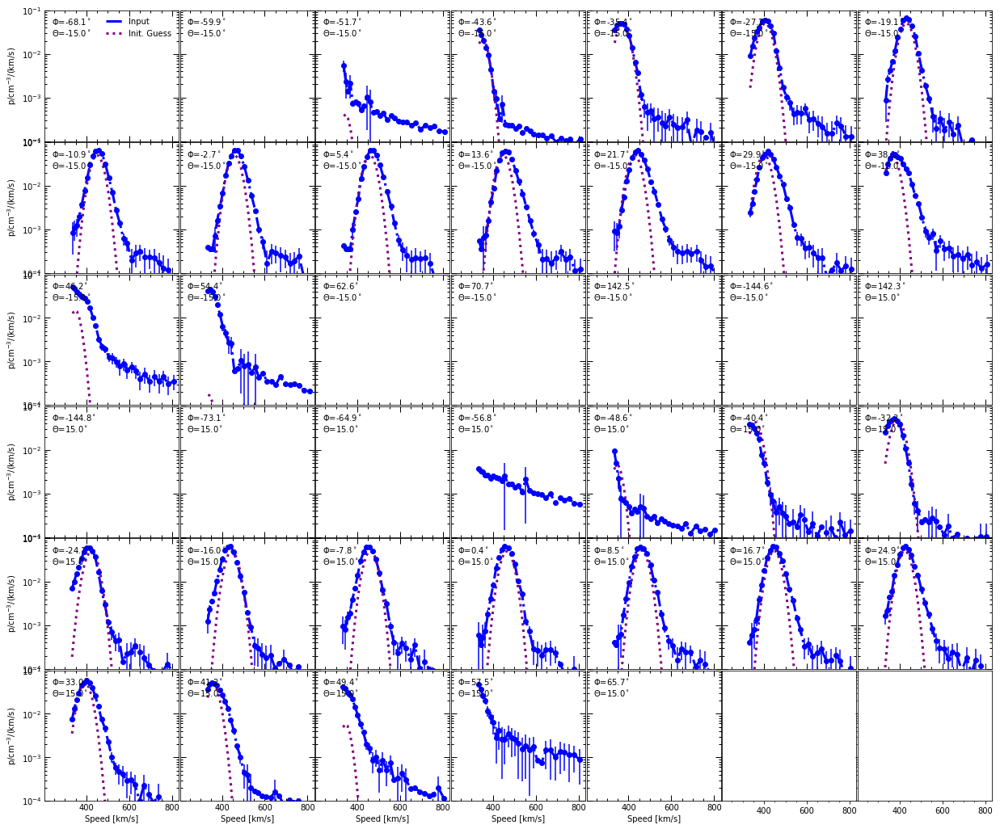
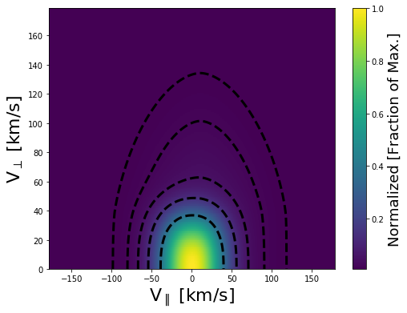
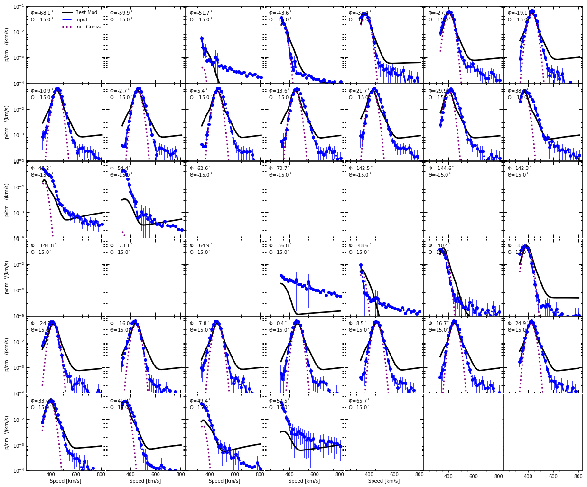
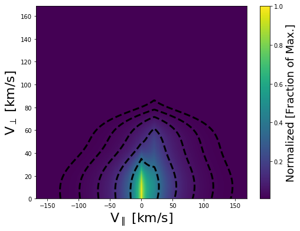
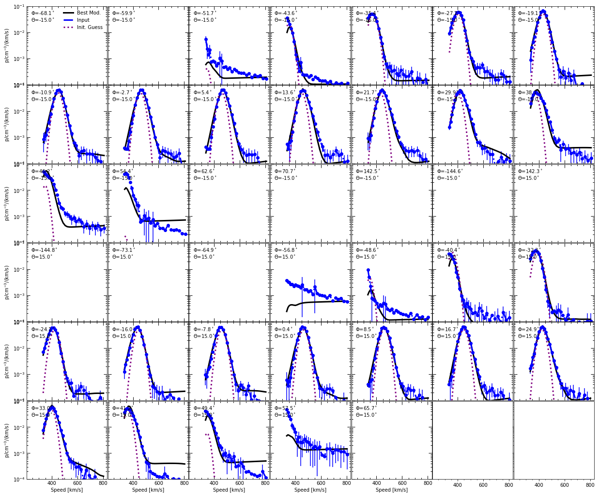

.. Solar Wind Tomography documentation master file, created by
   sphinx-quickstart on Thu Mar 21 16:39:39 2019.
   You can adapt this file completely to your liking, but it should at least
   contain the root `toctree` directive.

Welcome to Solar Wind Tomography's documentation!
=================================================

.. toctree::
   :maxdepth: 2
   :caption: Contents:

Context
-------

Introduction
~~~~~~~~~~~~

Observation
~~~~~~~~~~~

Analysis
~~~~~~~~

Conclusions/Future Work
~~~~~~~~~~~~~~~~~~~~~~~

Code
----

Example
~~~~~~~

Here I will briefly describe the process for reconstructiong the 2D velocity distribution from a sampling of 1D FC velocity observations at different look angles.
First, you will need to import the modules needed to successfully call the code. Most of which are the modules created in this code.

First, you need to import the modules required to reconstruct the solar wind observations.

.. code-block:: python

    import make_discrete_vdf as mdv
    import read_fmt_obs as rfo
    import multi_fc_functions as mff
    from scipy import optimize
    import numpy as np
    import time

Next, specify a time period you are interented in reconstructing. 
This time period needs to be in a format recognizable by the pd.to_datetime() function.

.. code-block:: python

    #Time you are interested in reconstructing
    date = '2019/02/09 00:10:00'

Once you select the time period you are interested in,
call the module that formats observations into something that can be read by the reconstruction code suite.
Here we will try to reconstruct a set of Wind observations.

.. code-block:: python

    #Read in Wind spectra and parameters and format them in a way that can be used by the reconstruction program
    fcs,vdf_inpt = rfo.fmt_wind_spec(date,spec_dir='test_obs/test_wind_spectra/',parm_dir='test_obs/test_wind_spectra/')

Now that we have the Wind observations in a nice format,
let us go ahead and plot the observations and the single bi-maxwellian fit.

.. code-block:: python

    #Plot the Observations of all Wind FCs and the Velocity distribution if the bi-maxwellian solution 
    #Derived by Wind for each FC
    mff.create_fc_grid_plot(fcs,log_plot=True,ylim=[1e-4,1e-1])

It is apparent that the bi-maxwellian leaves something to be desired,
so let us try a different model of the solar wind.
Specifically, let us use a `Generalized Normal Distribution <https://www.tandfonline.com/doi/abs/10.1080/02664760500079464>`_ with a secondary peak.

.. code-block:: python

    #Trying a guess based on a previous failed try at fitting a Wind observation
    human_guess = [ -4.35047381e+02,  -1.35264270e+01,   7.15811005e+00,   2.51430881e+01,
                     2.70190565e+01,   2.06592978e-02,   2.81259051e+00,   2.16901722e+00,
                     3.84810371e+01,   1.06937488e+01,   4.40914378e+01,   4.85236340e+01,
                     6.79767052e-03,   1.60664033e+00,   1.78231253e+00,]                

The first three parameters are the Vx, Vy, and Vz parameters, so 
in this example I took a previous parameter guess and updated the velocity
components because we have the data for it.

.. code-block:: python

    #Previous observation was at a different time so adjust velocity solution
    human_guess[:3] = vdf_inpt['u_gse']
    #Get magnetic fields from Wind CDF file that is stored in the vdf dictionary
    b_gse = vdf_inpt['b_gse']
    #Set the size of the VDF solution
    vel_clip = 200. #km/s

Now that we have an initial guess of parameters, 
we can build a theoretical proton velocity distribution 
in the V:subscript:`parallel`\ and V:subscript:`perpendicular`\ reference
frames.

.. code-block:: python

    #Show what the initial guess assuming at generalized normal distribution
    #looks like compared to the measurements and the bi-maxellian fit and Observations
    dis_vdf_human = mdv.make_discrete_gennorm_vdf(human_guess,b_gse,pres=1.00,qres=1.00,clip=vel_clip,
                                                  add_ring=human_guess[8:])
    #Plot what the velocity distribution looks like
    mdv.plot_vdf(dis_vdf_human)

Then we can "measure" the theoretical velocity distribution and compare it with the FC measurements.

.. code-block:: python

    #measure the velocity distribution for each FC based on the input parameters
    samp = 15.
    for k,i in enumerate(fcs.keys()):
        i = 'fc_{0:1d}'.format(k)
        #updated using dynamic sampling 2018/10/12 J. Prchlik
        fcs[i]['dis_cur'] = mdv.arb_p_response(fcs[i]['x_meas'],dis_vdf_human,samp)
    
    #Plot the measurements with the initial guess overplotted
    mff.create_fc_grid_plot(fcs,log_plot=True,ylim=[1e-4,1e-1])

We can see our initial guess of the velocity distribution is not very good. 
That is the spectrum generated from the theoretical FC response to the incomming plasma velocity distribution (black) does not match the observed proton distributions (blue). 
If we can get the measured and generated velocity distribution to match for all FC measurements, 
then we may be able to understand the structure of the incomiing velocity distribution.
Since we initially assumed the velocity distribution may be modelled by a generalized normal distribution,
we may vary those parameters until we find a best fit solution.
To find the best fit solution we use the Nelder-Mead algorithm to minimize the X:superscript:`2`\ for each measurement.
Briefly, the Nelder-Mead algorithm uses a series of simplices (i.e. triangles) to find the solution that minimizes X:superscript:`2`\ .
For this examples we added a secondary generalized normal distribution to improve the final fit.

.. code-block:: python

    #maximum tries
    max_try = 2200*3 #about 12 hours
    #Notice NM can converge better than Powell with complex solutions, so trying it now
    #Nelder-Mead is superior algorithm to the Powell Method, so for now I recommend using
    #the Nelder-Mead algorithm 
    x1 = time.time()
    #Try to minimize the sum squared errors for all FC to fit the best fit
    #True means include ring in final fit
    nm_human = optimize.minimize(mff.gennorm_2d_reconstruct,human_guess, args=(fcs,dis_vdf_human,True),method='Nelder-Mead',
                                options={'xtol':1e-1,'ftol':1e-1,'disp':True,'maxiter':max_try,'maxfev':max_try})
    x2 = time.time()

Optimization terminated successfully.
Current function value: 5.422494
Iterations: 2214
Function evaluations: 2934

.. code-block:: python

    #Total run time until convergence
    print('Total Run Time {0:7.1f} min'.format((x2-x1)/60.))

Total Run Time   375.6 min

Now add the best fit solution for each FC to the corresponding 'dis_cur' key for each dictionary object and plot the 2D velocity distribution.

.. code-block:: python

    #Create Vper and Vpar velocity distribution and plot it
    human_vdf =  mdv.make_discrete_gennorm_vdf(nm_human.x,b_gse,pres=1.00,qres=1.00,clip=vel_clip,
                                                      add_ring=nm_human.x[8:])
    #Make the observations for the best fit solution
    samp = 15.
    for k,i in enumerate(fcs.keys()):
        i = 'fc_{0:1d}'.format(k)
        #updated using dynamic sampling 2018/10/12 J. Prchlik
        fcs[i]['dis_cur'] = mdv.arb_p_response(fcs[i]['x_meas'],human_vdf,samp)
        
    #Plot the best fit 2D velocity distribution
    mdv.plot_vdf(human_vdf)

Next, plot what the modelled velocity distribution would look like to the FCs (solid, black) and compare it visually to the FC measurements (blue, dashed) and the bi-maxwellian solution (purple, dotted). 

.. code-block:: python

    #Visually compare the best fit velocity solution (Best Mod.), the bi-maxwellian (Init. Guess), and the observations (Input)
    mff.create_fc_grid_plot(fcs,log_plot=True,ylim=[1e-4,1e-1])

Finally, we may estimate the uncertainty in each fitting parameter by using the simplex method outlined in Nelder and Mead (1965).
Note this will take some time because the program needs to calculate new values at simplex points on a grid, so I broke it down to a sub sample of observations.

.. code-block:: python

    #get a sub-sample of FC to test the uncertainty value
    fc_test = {}
    fc_list = ['fc_10','fc_32']
    for j,i in enumerate(fc_list):
        fc_test['fc_{0:1d}'.format(j)] = fcs[i]

    #calculate the covariance matrix
    covar = mff.cal_covar_nm(nm_human.final_simplex,mff.gennorm_2d_reconstruct,(fc_test,dis_vdf_human,True),return_all=False)

And convert the covarience matrix into a percent uncertainty for each parameter.

.. code-block:: python

    #Uncertainties assuming non-correlated errors
    #total unceratinty for each parameter as a percent
    print(100.*np.sqrt(2.*(nm_human.final_simplex[1][0])**2*np.diag(np.abs(covar)))/np.abs(nm_human.x))

[ 0.01931854  0.86215472  2.21693913  0.66579313  0.55633987  0.52998703
1.01127704  1.32661807  0.93936466  0.55195308  2.69801755  4.01133724
3.60696195  1.78138854  1.34935791]

Indices and tables
==================

* :ref:`genindex`
* :ref:`modindex`
* :ref:`search`
