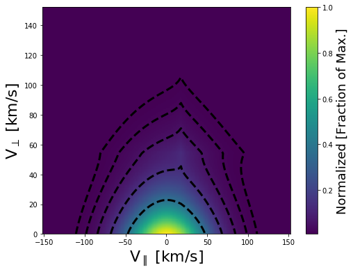

.. Solar Wind Tomography documentation master file, created by
   sphinx-quickstart on Thu Mar 21 16:39:39 2019.
   You can adapt this file completely to your liking, but it should at least
   contain the root `toctree` directive.

Welcome to Solar Wind Tomography's documentation!
=================================================

.. toctree::
   :maxdepth: 2
   :caption: Contents:

Context
-------

Introduction
~~~~~~~~~~~~

Observation
~~~~~~~~~~~

Analysis
~~~~~~~~

Conclusions/Future Work
~~~~~~~~~~~~~~~~~~~~~~~

Code
----

Example
~~~~~~~

Here I will briefly describe the process for reconstructiong the 2D velocity distribution from a sampling of 1D FC velocity observations at different look angles.
First, you will need to import the modules needed to successfully call the code. Most of which are the modules created in this code.

.. code-block:: python

    import make_discrete_vdf as mdv
    import read_fmt_obs as rfo
    import multi_fc_functions as mff
    from scipy import optimize

.. code-block:: python

    #Time you are interested in reconstructing
    date = '2019/02/09 00:10:00'

.. code-block:: python

    #Read in Wind spectra and parameters and format them in a way that can be used by the reconstruction program
    fcs,vdf_inpt = rfo.fmt_wind_spec(date)

.. code-block:: python

    #Plot the Observations of all Wind FCs and the Velocity distribution if the bi-maxwellian solution 
    #Derived by Wind for each FC
    mff.create_fc_grid_plot(fcs)

.. code-block:: python

    #Trying a guess based on a previous failed try at fitting_wind_observation
    human_guess = [ -4.35047381e+02,  -1.35264270e+01,   7.15811005e+00,   2.51430881e+01,
                     2.70190565e+01,   2.06592978e-02,   2.81259051e+00,   2.16901722e+00,
                     3.84810371e+01,   1.06937488e+01,   4.40914378e+01,   4.85236340e+01,
                     6.79767052e-03,   1.60664033e+00,   1.78231253e+00,]                

.. code-block:: python

    #Previous observation was at a different time so adjust velocity solution
    human_guess[:3] = vdf_inpt['u_gse']

.. code-block:: python

    #Show what the initial guess assuming at generalized normal distribution
    #looks like compared to the measurements and the bi-maxellian fit and Observations
    dis_vdf_human = mdv.make_discrete_gennorm_vdf(human_guess,b_gse,pres=1.00,qres=1.00,clip=vel_clip,
                                                      add_ring=human_guess[8:])
    #Plot what the velocity distribution looks like
    mdv.plot_vdf(dis_vdf_human)
    #measure the velocity distribution for each FC based on the input parameters
    samp = 15.
    for k,i in enumerate(fcs.keys()):
        i = 'fc_{0:1d}'.format(k)
        #updated using dynamic sampling 2018/10/12 J. Prchlik
        fcs[i]['dis_cur'] = mdv.arb_p_response(fcs[i]['x_meas'],dis_vdf_human,samp)
    
    mff.create_fc_grid_plot(fcs)

.. code-block:: python

    #maximum tries
    max_try = 2200*3 #about 12 hours
    #Notice NM can converge better than Powell with complex solutions, so trying it now
    x1 = time.time()
    #Try to minimize the sum squared errors for all FC to fit the best fit
    #True means include ring in final fit
    nm_human = optimize.minimize(mff.gennorm_2d_reconstruct,human_guess, args=(fcs,dis_vdf_human,True),method='Nelder-Mead',
                                options={'xtol':1e-2,'ftol':1e-2,'disp':True,'maxiter':max_try,'maxfev':max_try})
    x2 = time.time()

.. code-block:: python
    #Total run time until convergence
    print('Total Run Time {0:7.1f} min'.format((x2-x1)/60.))

.. code-block:: python

    #Create Vper and Vpar velocity distribution and plot it
    human_vdf =  mdv.make_discrete_gennorm_vdf(nm_human.x,b_gse,pres=1.00,qres=1.00,clip=vel_clip,
                                                      add_ring=nm_human.x[8:])
    #Make the observations for the best fit solution
    samp = 15.
    for k,i in enumerate(fcs.keys()):
        i = 'fc_{0:1d}'.format(k)
        #updated using dynamic sampling 2018/10/12 J. Prchlik
        fcs[i]['dis_cur'] = mdv.arb_p_response(fcs[i]['x_meas'],human_vdf,samp)
        
    #Plot the best fit 2D velocity distribution
    mdv.plot_vdf(human_vdf)

.. code-block:: python

    #Visually compare the best fit velocity solution (Best MC), the bi-maxwell (Init. Guess), and the observations (Input)
    mff.create_fc_grid_plot(fcs)

.. image:: _static/fc_measurements.png
   :alt: FC Obs. Plot
   :align: center
   :scale: 60%

Indices and tables
==================

* :ref:`genindex`
* :ref:`modindex`
* :ref:`search`
